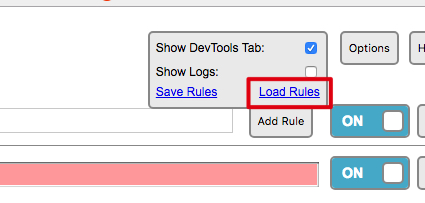

My Chrome Local Files
=====================

使用[Resource Override](https://chrome.google.com/webstore/detail/resource-override/pkoacgokdfckfpndoffpifphamojphii)这个chrome extension，
把一些耗费时间的web resource替换为本地文件。

使用Resource Override的load-rules功能把本地的`resources_override_rules.json`导入进去（可能需要先删除已有的）：

